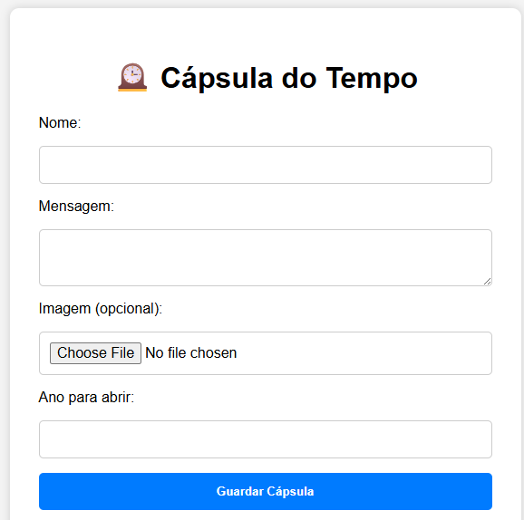

# 🕰️ Time Capsule


> Aplicação web minimalista que permite aos utilizadores deixar uma mensagem e uma imagem para serem abertas num ano futuro.

---

## 🖼️ Preview



---

## 📁 Estrutura do Projeto


---

📁 Estrutura do Projeto

time-capsule/
├── backend/ # Servidor Express + PostgreSQL
├── frontend/ # HTML, CSS e JS simples
├── database/ # Scripts SQL de criação


---

## 🚀 Tecnologias

- **Frontend:** HTML5 + CSS3 + JavaScript
- **Backend:** Node.js + Express.js + Multer
- **Base de Dados:** PostgreSQL
- **Ambiente:** `.env` para variáveis de ambiente

---

## 📦 Instalação

### 🔧 Pré-requisitos

- Node.js (v18+)
- PostgreSQL (v13+)
- (Opcional: Docker)

### ⚙️ Backend

```bash
cd backend
npm install
cp .env.example .env  # e configura a ligação à base de dados
npm run dev

🧾 Base de Dados
psql -U postgres -f database/setup_capsuledb.sql
Base capsuledb

Utilizador capsuleuser
Tabela time_capsules
Permissões de acesso

## Estrutura da Tabela

Campo	Tipo	Descrição
id	SERIAL	Chave primária
name	VARCHAR(100)	Nome do remetente
message	TEXT	Mensagem deixada
image_url	TEXT	Caminho local da imagem (opcional)
open_year	INT	Ano para abertura da cápsula
created_at	TIMESTAMP	Data de criação automática


🔐 Segurança

As imagens são guardadas localmente (uploads/)
.env está no .gitignore
Permissões de acesso à DB são definidas por utilizador
O ano de abertura define quando a mensagem pode ser visualizada


✨ Funcionalidades Futuras

Autenticação por PIN ou e-mail
Envio de e-mail automático no ano de abertura
Exportação da cápsula como imagem ou PDF
Deploy com Docker ou Render

Autor
Mauro Venâncio Chemane
🇲🇿 Maputo, Moçambique
Desenvolvedor de software e entusiasta de soluções digitais com impacto social.